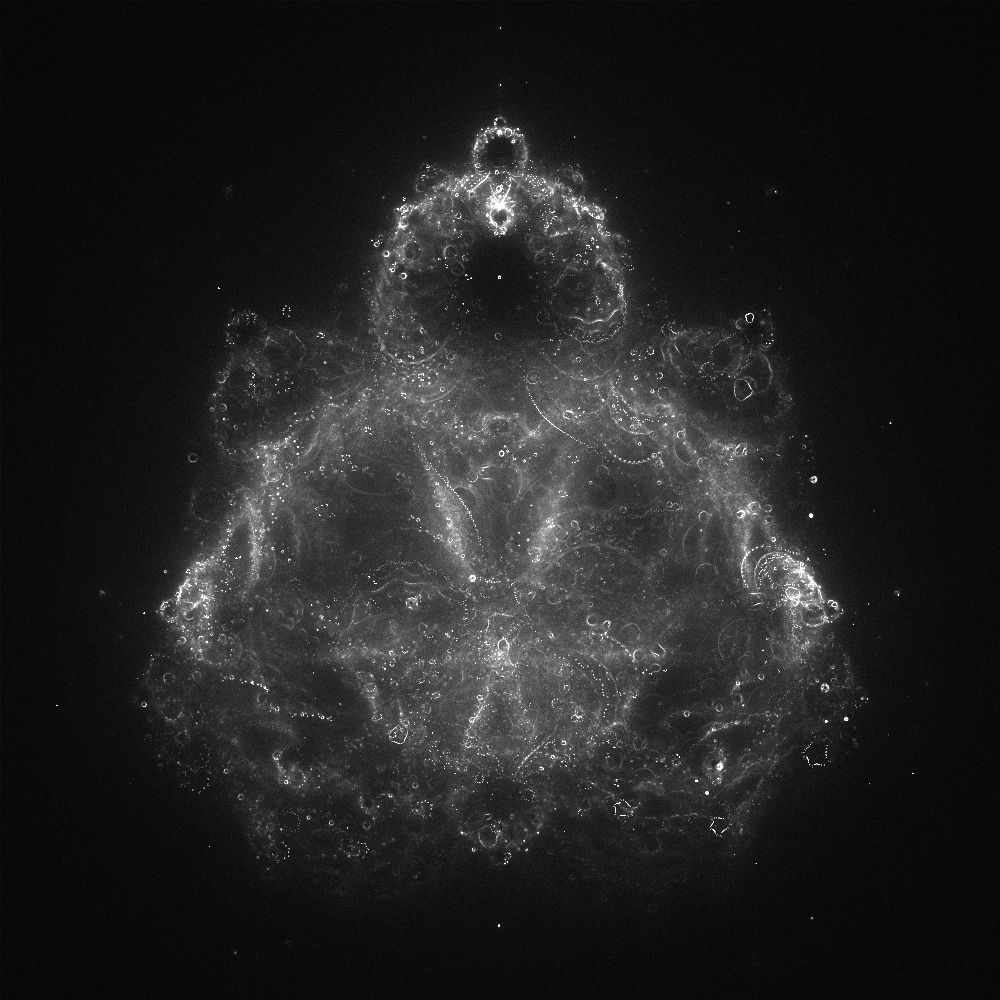

# buddhabrot
render the probability distribution over the trajectories of points that escape the Mandelbrot fractal

**mandelbrot**      render traditional mandelbrot set  
**buddhabrot**      render buddhabrot (C implementation, 2x to 3x faster)  
**buddhabrotpp**    render buddhabrot (C++ implementation using complex.h)  
**buddhabrotmt**    render buddhabrot (multithreaded implementation, fastest)  
**imshow**          display rendered image data and save as a color PNG image
                    (Python 3, numpy, Matplotlib)  
**imgshow**         display rendered image data and save as a grayscale PNG
                    image (Python 3, numpy, Pillow)  
**tkimg**           display a PNG image (Tcl wish, libtk-img)  



#### render buddhabrot image and save as intermediate file format
```
buddhabrot -w1024 -h1280 -i1000 -s10000000 images/bb-i1k-s10M
```

#### display and save image using the colormap viridis
```
imshow -t -cviridis images/bb-i1k-s10M
```

#### display and save image clipping values above a specified value
```
imshow -t -m250 images/bb-i1k-s10M
```

#### show and save image as a grayscale PNG
```
imgshow -t -m250 images/bb-ilk-s10M
```
